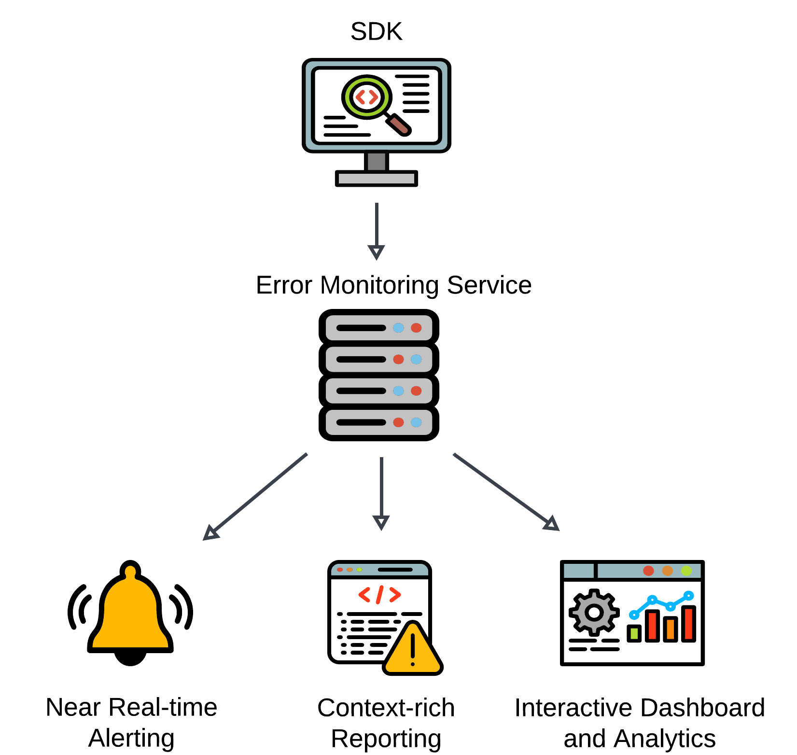

# Introducing Flytrap

Flytrap is a lightweight, self-hosted error monitoring tool designed to meet the needs of small to mid-sized development teams. By focusing exclusively on error detection and resolution, Flytrap avoids the bloat of broader observability platforms, offering a streamlined, efficient alternative that prioritizes clarity, simplicity, and full data ownership. Flytrap allows teams to retain complete control over their error data, ensuring privacy and compliance with their own infrastructure.
This case study explores the technical domain of error handling across languages and frameworks, examines the challenges developers face with traditional error monitoring tools, and highlights Flytrap’s approach to addressing these gaps. It concludes with a discussion of engineering challenges encountered and an analysis of key implementation decisions.

## Why Error Monitoring Matters

Modern applications are more complex than ever, with distributed architectures, microservices, and client-server integrations that introduce a multitude of potential failure points. Silent failures pose a significant threat in this environment. Unlike bugs caught during testing or staging, silent failures often escape detection until they manifest as poor user experiences, leading to user churn, lost revenue, or even irreparable damage to a company’s reputation.

When errors occur in production, users often serve as the first point of feedback, reporting broken functionality or unexpected behavior. This method is inherently flawed. Users rarely provide sufficient technical details about the failure, making it challenging for developers to recreate and resolve issues. Furthermore, by the time an error is reported, the damage is already done: poor user experiences have already degraded trust in the application.

## Exploring the Technical Domain of Error Monitoring

Error monitoring plays a vital role in modern software development, ensuring systems remain reliable, responsive, and user-friendly. Errors can range from straightforward syntax mistakes to complex unhandled exceptions, each requiring a tailored approach to identify and resolve. Addressing these issues effectively demands a deep understanding of their origins and behaviors across different parts of the application.
Broadly, the technical domain of error monitoring can be divided into two key areas: frontend and backend.

### Frontend Errors: Synchronous and Asynchronous Complexities

Frontend monitoring must address errors across diverse user devices, browsers, and network conditions. Key error types include:

- Synchronous Errors: Occur immediately during execution, such as invalid operations or undefined variables. While easy to identify, they become harder to isolate in complex architectures like React's component-based design.

- Asynchronous Errors: Arise in non-blocking operations like API requests or user-triggered events. These often manifest as silent failures, cascading into UI issues that are difficult to trace.

- Contextual Challenges: Debugging requires metadata like user actions, browser state, and network conditions to provide the context needed for root cause analysis.

Modern client-facing applications operate in diverse and unpredictable environments, presenting unique challenges for identifying and resolving errors. Unlike backend systems, where the environment is server-controlled, frontend errors must be managed across a variety of user devices, browsers, and network conditions.

<!--   -->

### Backend Errors: Framework-Specific Approaches

Backend monitoring captures issues in server-side execution, often relying on framework-specific approaches:

- Middleware-Based Errors: Frameworks like Express use middleware chains to manage request and error flows but can miss dynamically loaded or asynchronous issues.

- Exception-Driven Errors: Flask leverages Python's exception hierarchy for fine-grained error handling, though it requires careful design to avoid excessive noise in error reporting.

- Unhandled Runtime Errors: Tools like Node.js's process.on('unhandledRejection') and Python's sys.excepthook catch critical exceptions but often lack complete context, complicating debugging.

On the backend, error monitoring focuses on capturing issues during server-side execution, such as API failures, database errors, and unhandled exceptions. Each backend framework introduces unique patterns and conventions for handling errors, complicating the creation of a unified monitoring strategy.

<!--  -->

### Bridging Frontend and Backend Challenges

The interplay between frontend and backend error monitoring introduces additional complexity. Frontend errors often cascade into backend issues, such as invalid API calls or malformed data requests. Conversely, backend errors can propagate to the frontend, manifesting as unexpected UI behaviors or incomplete data rendering.

Ensuring a cohesive error-monitoring strategy requires:

- Consistent Error Context: Capturing and correlating contextual data (e.g., user actions, session information) across the stack to diagnose issues effectively.

- Unified Framework Coverage: Understanding and adapting to the unique error-handling paradigms of each framework, from middleware chains in Express to decorator-driven error handlers in Flask.

- Handling Silent Failures: Identifying and addressing errors that do not immediately surface, such as intermittent API failures or ignored exceptions in asynchronous code.

Designing robust, responsive, and resilient error monitoring software begins by recognizing the distinctions and overlaps in error-handling paradigms across frontend and backend environments and identifying how to handle these disparities in a standardized, predictable manner.

## Key Components of Error Monitoring Software

Error monitoring software is vital for maintaining application performance and stability. These tools typically integrate several essential components, each designed to streamline the detection, analysis, and resolution of errors in real time.

### SDKs for Error Collection

Software Development Kits (SDKs) play a foundational role in error monitoring. These lightweight agents are embedded directly into application code to capture a range of issues, from unhandled exceptions to promise rejections. By automatically relaying error details—such as error types, frequency, and affected users—SDKs ensure developers can monitor applications without adding significant performance overhead. Most tools offer platform-specific SDKs tailored to web applications or backend services, enabling seamless error tracking across diverse environments.

### Neal Real-Time Alerting

Near real-time notifications are crucial for minimizing downtime and ensuring a swift response to emerging issues. Modern error monitoring tools often provide flexible alerting mechanisms, utilizing client dashboards that automatically update to keep developers aware of issues their users are experiencing as they occur. Some advanced tools group similar errors into a single notification, reducing alert fatigue while maintaining situational awareness. This proactive approach enables teams to address critical issues before they escalate into widespread user disruptions.

### Context-Rich Reporting

Detailed reporting is the cornerstone of effective error diagnostics. Comprehensive error reports go beyond surface-level information, capturing stack traces, user session data, and relevant metadata like device specifications, network conditions, or browser types. Some systems also support custom annotations, which help correlate errors with recent code changes or deployments. This level of context is invaluable for pinpointing root causes and crafting targeted fixes, reducing the time spent on troubleshooting.

### Dashboards and Analytics

Dashboards offer a centralized, visual representation of error trends, allowing teams to monitor application health at a glance. These interfaces often include customizable widgets for tracking key metrics like error frequency, affected users, and resolution times. Integrated analytics further enhance this capability by identifying recurring issues, correlating errors with user behaviors, and evaluating the effectiveness of fixes over time.

<!--  -->

## Positioning Flytrap in the Error Monitoring Landscape

The error monitoring landscape includes a wide range of tools offering extensive features for tracking and managing application issues. However, these solutions often come with trade-offs. While comprehensive, they can be overly complex or rigid, posing challenges for teams prioritizing streamlined error detection and resolution over intricate configurations or feature bloat. Additionally, many of these tools store error data on external servers, raising concerns about data ownership and privacy.

Flytrap was developed to address these gaps, offering a focused, lightweight alternative tailored to teams that prioritize streamlined error monitoring, control over infrastructure, data ownership, and usability without sacrificing performance.

### Common Shortcomings of Error Monitoring Software

Many modern error monitoring tools have expanded their scope to include observability, performance metrics, and infrastructure monitoring. Sentry, Rollbar, and Bugsnag are just a few examples of such tools. Other top error monitoring systems, such as those offered by Datadog and New Relic, are add-ons to observability-first platforms. While valuable in some contexts, the trend of combining error monitoring and observability tools introduces several challenges for teams focused solely on debugging.

#### Overengineered Solutions

Many tools generate vast amounts of auxiliary data, such as application performance insights or infrastructure-level metrics, which are irrelevant to diagnosing and resolving errors. These additional layers of information often slow the debugging process, making tools harder to navigate and use efficiently.

#### Performance Overhead

Larger platforms often implement extensive data collection to support broader monitoring and observability features. While this can be invaluable for users leveraging combined error monitoring and observability capabilities, it introduces unnecessary overhead for those focused solely on error-tracking functionality.

#### Lack of Data Privacy and Control

Most tools require organizations to store error data on the vendor’s servers, raising concerns about compliance, regulatory alignment, and data ownership. This dependency on external infrastructure introduces potential risks and constraints for teams managing sensitive applications. While some offer self-hosted versions, these often come with enterprise-level pricing and complex setup requirements, making them less accessible for smaller teams or organizations with limited resources.

<!--  -->

### How Flytrap Addresses These Challenges

Flytrap focuses exclusively on error monitoring, aiming to simplify integration, reduce overhead, and give teams full control over their error data. Its design emphasizes:

#### Focused Functionality

Unlike general-purpose platforms that combine error monitoring with observability, Flytrap narrows its focus to error detection and reporting. This specificity minimizes distractions and allows teams to concentrate on resolving issues rather than navigating extraneous features.

#### Minimal Overhead

Flytrap’s SDKs are built to collect only the data necessary for debugging, minimizing their impact on application performance. The lightweight design ensures scalability, even for resource-constrained applications.

#### Infrastructure Independence

Flytrap stands out by allowing teams to deploy all infrastructure on their own AWS accounts. This gives organizations complete control over their error data, aligning with privacy and compliance requirements while avoiding vendor lock-in. This also means full ownership and control over sensitive error data and source code, mitigating concerns about third-party storage and privacy. Additionally, Flytrap simplifies the deployment process by reducing setup complexity through automated provisioning.

#### Comparative Analysis

A side-by-side comparison of Flytrap and established tools highlights its position in the error monitoring landscape:

This comparison underscores Flytrap’s niche: a lightweight tool designed for small to mid-sized development teams that prioritize efficient error monitoring, data ownership, and infrastructure control without the distractions of observability or performance tracking.

By focusing exclusively on error monitoring, Flytrap fills a gap in the landscape, offering a practical and efficient alternative to more complex platforms. This makes it an ideal choice for teams that value simplicity, transparency, and privacy. Flytrap may not be the right choice for teams seeking fully integrated observability or those without access to AWS.

## Flytrap Architecture

Flytrap's architecture is a robust and carefully designed system that balances scalability, security, and user-specific provisioning. The platform is fully provisioned via Terraform and hosted within the user's AWS account, offering full control over the infrastructure while maintaining isolation and compliance.

Flytrap utilizes a streamlined pipeline to efficiently detect, process, store, and report errors. This design provides a seamless flow of information, enabling timely insights while maintaining robust security and scalability. In the upcoming sections, we will explore each component of Flytrap’s architecture in detail, following the journey of an error from capture to resolution.

### SDK Development: Cross-Platform Error Handling

Flytrap SDKs provide consistent error handling across diverse environments, including React, Vanilla JS, Express, and Flask. Designed for ease of use, the SDKs feature a modular structure that simplifies integration for developers. Captured errors are standardized into a unified JSON schema to ensure seamless backend processing.

#### SDK Integration

- React & Express: Installed via npm.
- Flask: Integrated via pip.
- Vanilla JS: Imported via script tags.

#### Error Capture Mechanisms

- React: Integrates with lifecycle methods for client-side exceptions.
- Express & Flask: Captures errors via middleware and WSGI layers.
- Vanilla JS: Uses window.onerror and window.onunhandledrejection.
- Manual Error Capture: All SDKs provide a method for developers to manually capture errors in try/catch blocks or other contexts where automatic capture is insufficient.

#### Unified Error Schema

Errors are normalized into a consistent JSON structure that includes:

- Name, message, and stack trace.
- Code context and metadata, such as method, path, OS, browser, and runtime (when applicable).

This uniform schema ensures that the Flytrap backend processes errors efficiently while providing developers with actionable debugging insights. Once captured and standardized, the SDK securely transmits the formatted payloads to the API Gateway, marking the start of the backend processing pipeline.

<video controls autoPlay muted loop>
  <source src="/img/case-study/diagrams/flytrap-ui-demo.mp4" type="video/mp4" />
  Your browser does not support the video tag.
</video>
